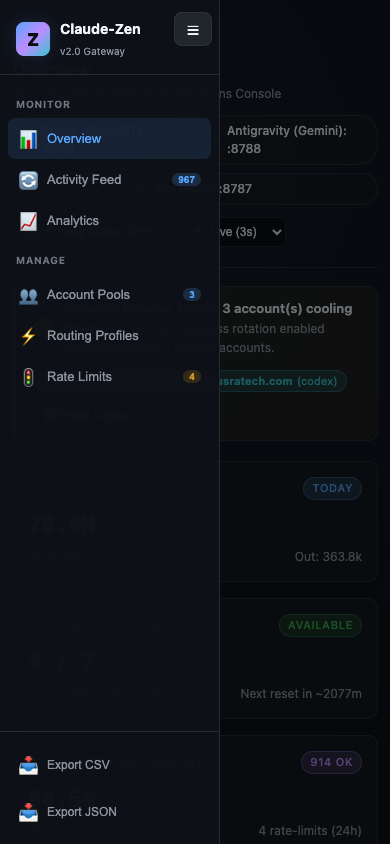

# Dogfood Report: Claude-Zen Dashboard

| Field | Value |
|-------|-------|
| **Date** | 2026-08-19 |
| **App URL** | http://127.0.0.1:8789/dashboard |
| **Session** | zen-ui / zen-mobile / zen-final |
| **Scope** | Sidebar restructuring, cursor pagination, mobile navigation, accessibility, console errors, and live account quota rendering |

## Summary

| Severity | Count |
|----------|-------|
| Critical | 0 |
| High | 0 |
| Medium | 0 |
| Low | 0 |
| **Total** | **0** |

## Issues

No reproducible issues remain. Live verification covered:

- Desktop section navigation and exactly one visible content section.
- Activity pages of 20 records, Next, Previous, empty search, and filter reset.
- Mobile drawer open/close, Escape focus restoration, and section activation.
- Zero browser console/page errors and zero automated WCAG A/AA violations.
- Live ChatGPT weekly quota data and supported-model metadata.

Two defects found during review were fixed before this report: cursor-changing actions could be dropped during an in-flight auto-refresh, and sidebar buttons had an incorrect `listitem` role that interfered with button interaction. The mobile toggle was also moved away from the logo while the drawer is open.

